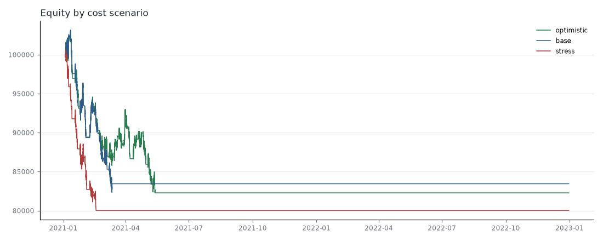
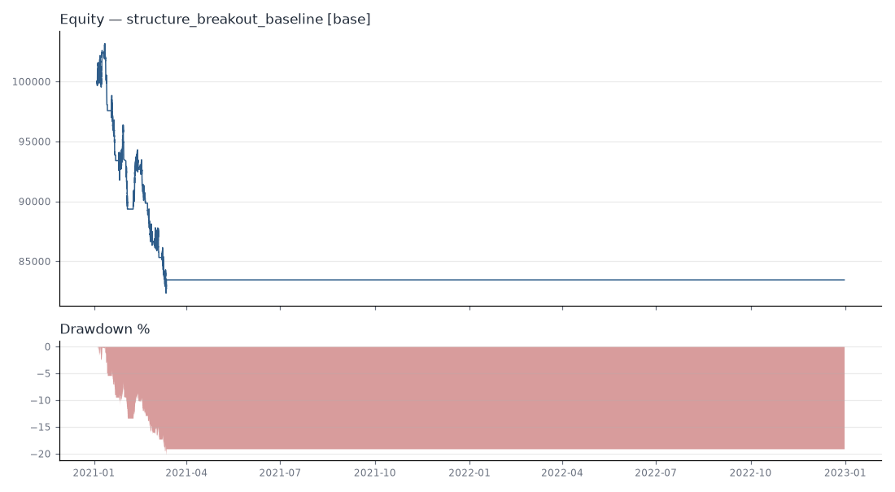
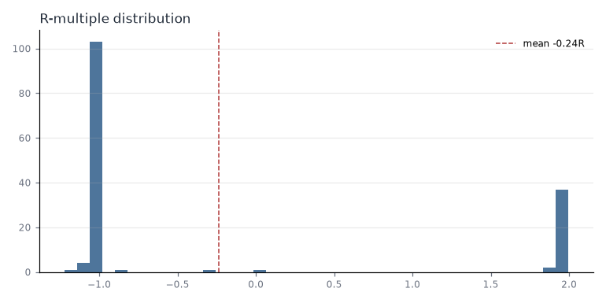
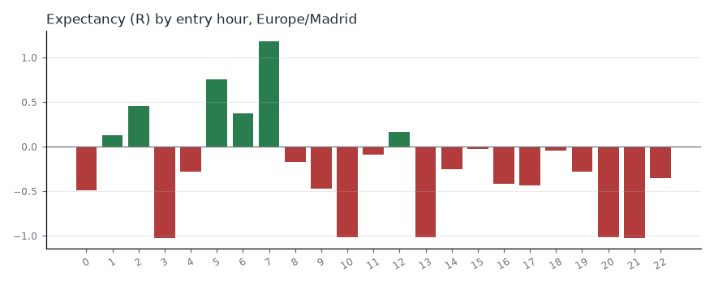
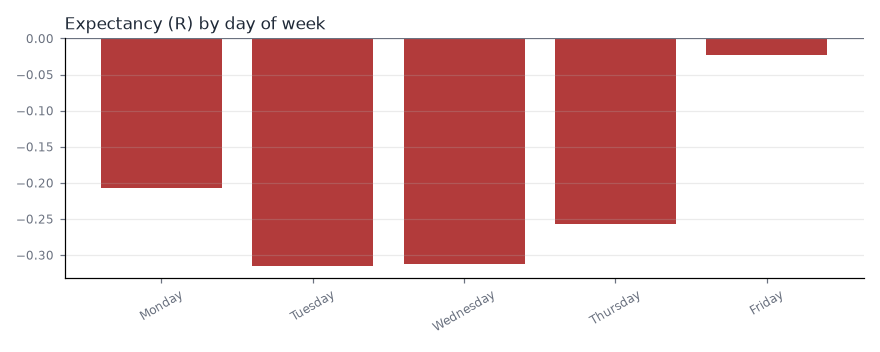
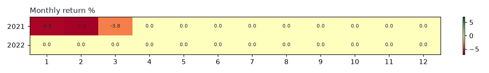
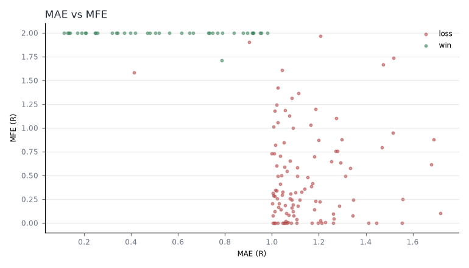

# EXP000 — pipeline smoke test

**Final status: `REJECT`**  

Date: 2026-10-03T05:00:32+00:00 · Commit: `2dd26e708f8eb39b07f7acac27d9aca9399c3412` · Segment: `train` · OOS used: **False**

## Summary

Hypothesis: None — EXP000 only verifies the pipeline end to end on SYNTHETIC random-walk data. Expected result: no edge; losses roughly equal to costs.

Primary cost scenario `base`: 150 trades, expectancy -0.238 R (t = -2.233), PF 0.679, net -16.553%, max DD 20.167%.

**Max-drawdown kill switch fired** — no new entries after: `optimistic` 2021-05-13 00:15:00+00:00, `base` 2021-03-12 01:05:00+00:00, `stress` 2021-02-17 00:15:00+00:00. Statistics after that point are missing, so the sample is truncated.

## Strategy

`structure_breakout_baseline` on `M5`.

## Dataset

| index | value |
|---|---|
| instrument | XAUUSD |
| source | synthetic |
| synthetic | True |
| timeframe | M5 |
| timezone | UTC |
| source_timezone | UTC |
| price_basis | bid |
| volume_type | tick |
| has_spread | True |
| spread_units | price |
| start | 2021-01-04 00:00:00+00:00 |
| end | 2024-12-31 23:55:00+00:00 |
| n_bars | 287592 |
| content_hash | 03eeb07e5ad51469 |
| created_at | 2026-10-03T04:54:51+00:00 |
| notes | SYNTHETIC random-walk data: no real edge exists; for pipeline tests only. |
| segment | train |
| segment_start | 2021-01-04 00:00:00+00:00 |
| segment_end | 2022-12-30 21:55:00+00:00 |
| segment_bars | 143508 |

## Parameters

```yaml
swing_left: 3
swing_right: 3
break_mode: close
events: ['BOS', 'CHOCH']
stop_buffer: 0.1
min_stop: 0.5
max_stop: 15.0
rr: 2.0
max_bars_in_trade: 288
session_filter: None
```

## Performance by cost scenario

| index | optimistic | base | stress |
|---|---|---|---|
| number_of_trades | 290 | 150 | 101 |
| net_profit | -17,721 | -16,553 | -19,969 |
| net_profit_pct | -17.721 | -16.553 | -19.969 |
| gross_profit | 74,469 | 35,042 | 17,989 |
| gross_loss | -92,190 | -51,595 | -37,959 |
| profit_factor | 0.808 | 0.679 | 0.474 |
| win_rate | 0.297 | 0.267 | 0.218 |
| loss_rate | 0.703 | 0.733 | 0.782 |
| expectancy | -61.109 | -110 | -198 |
| expectancy_r | -0.131 | -0.238 | -0.440 |
| median_r | -1.003 | -1.014 | -1.064 |
| t_stat_r | -1.645 | -2.233 | -3.544 |
| p_value_r | 0.101 | 0.027 | 0.001 |
| average_trade | -61.109 | -110 | -198 |
| average_win | 866 | 876 | 818 |
| average_loss | -452 | -469 | -480 |
| largest_win | 1,020 | 986 | 940 |
| largest_loss | -1,006 | -578 | -640 |
| max_consecutive_wins | 5.000 | 4.000 | 2.000 |
| max_consecutive_losses | 14.000 | 14.000 | 14.000 |
| max_drawdown_pct | 20.091 | 20.167 | 20.410 |
| max_drawdown_money | 20,687 | 20,803 | 20,523 |
| avg_drawdown_pct | 1.042 | 0.991 | 4.350 |
| sharpe | -1.093 | -1.358 | -2.151 |
| sortino | -1.387 | -1.647 | -2.214 |
| cagr_pct | -9.360 | -8.713 | -10.616 |
| calmar | -0.466 | -0.432 | -0.520 |
| recovery_factor | -0.857 | -0.796 | -0.973 |
| trades_per_year | 146 | 75.569 | 50.883 |



## Drawdown (scenario `base`)



## Trade statistics

### By direction
| direction | trades | win_rate | expectancy_r | median_r | profit_factor | net_pnl | avg_mae_r | avg_mfe_r |
|---|---|---|---|---|---|---|---|---|
| long | 69 | 0.246 | -0.311 | -1.017 | 0.589 | -10,086 | 1.010 | 0.849 |
| short | 81 | 0.284 | -0.176 | -1.013 | 0.761 | -6,467 | 0.960 | 0.921 |

### By setup
| setup | trades | win_rate | expectancy_r | median_r | profit_factor | net_pnl | avg_mae_r | avg_mfe_r |
|---|---|---|---|---|---|---|---|---|
| BOS | 63 | 0.238 | -0.319 | -1.015 | 0.584 | -9,426 | 0.991 | 0.867 |
| CHOCH | 87 | 0.287 | -0.180 | -1.014 | 0.754 | -7,127 | 0.977 | 0.904 |

### By exit_reason
| exit_reason | trades | win_rate | expectancy_r | median_r | profit_factor | net_pnl | avg_mae_r | avg_mfe_r |
|---|---|---|---|---|---|---|---|---|
| stop | 107 | 0.000 | -1.025 | -1.020 | 0.000 | -50,559 | 1.155 | 0.464 |
| stop_gap | 1 | 0.000 | -1.101 | -1.101 | 0.000 | -507 | 1.126 | 0.324 |
| take_profit | 39 | 1.000 | 1.953 | 1.954 | ∞ | 35,030 | 0.531 | 2.000 |
| time | 3 | 0.333 | -0.382 | -0.297 | 0.022 | -518 | 0.700 | 1.733 |



### Rejected signals

| reason | count |
|---|---|
| max_drawdown_halt | 8658 |
| max_open_positions | 488 |
| max_weekly_loss | 115 |
| max_consecutive_losses | 91 |
| max_daily_loss | 35 |

## Session analysis
| session | trades | win_rate | expectancy_r | median_r | profit_factor | net_pnl | avg_mae_r | avg_mfe_r |
|---|---|---|---|---|---|---|---|---|
| asia | 38 | 0.421 | 0.175 | -1.015 | 1.261 | 2,745 | 0.860 | 1.067 |
| golden_hours | 14 | 0.214 | -0.377 | -1.014 | 0.514 | -2,487 | 0.993 | 0.740 |
| ldn_ny_overlap | 12 | 0.333 | -0.013 | -0.999 | 1.068 | 239 | 0.791 | 1.209 |
| london | 36 | 0.139 | -0.584 | -1.015 | 0.334 | -9,474 | 1.112 | 0.777 |
| new_york | 28 | 0.179 | -0.505 | -1.018 | 0.411 | -6,444 | 1.050 | 0.637 |
| other | 22 | 0.318 | -0.082 | -1.019 | 0.845 | -1,131 | 0.998 | 1.000 |

### By entry hour (report timezone)
| hour_local | trades | win_rate | expectancy_r | median_r | profit_factor | net_pnl | avg_mae_r | avg_mfe_r |
|---|---|---|---|---|---|---|---|---|
| 0 | 11 | 0.182 | -0.489 | -1.028 | 0.419 | -2,532 | 1.119 | 0.654 |
| 1 | 18 | 0.389 | 0.131 | -1.012 | 1.182 | 938 | 0.937 | 1.059 |
| 2 | 4 | 0.500 | 0.457 | 0.464 | 1.793 | 810 | 0.814 | 1.160 |
| 3 | 2 | 0.000 | -1.027 | -1.027 | 0.000 | -993 | 1.086 | 0.723 |
| 4 | 4 | 0.250 | -0.281 | -1.027 | 0.617 | -562 | 0.892 | 0.547 |
| 5 | 5 | 0.600 | 0.760 | 1.938 | 2.807 | 1,743 | 0.614 | 1.321 |
| 6 | 5 | 0.600 | 0.371 | 0.026 | 1.864 | 809 | 0.746 | 1.319 |
| 7 | 4 | 0.750 | 1.187 | 1.905 | 5.526 | 2,080 | 0.718 | 1.624 |
| 8 | 7 | 0.286 | -0.168 | -1.020 | 0.726 | -679 | 0.967 | 1.186 |
| 9 | 11 | 0.182 | -0.474 | -1.015 | 0.437 | -2,417 | 0.954 | 0.636 |
| 10 | 12 | 0.000 | -1.019 | -1.017 | 0.000 | -5,692 | 1.220 | 0.656 |
| 11 | 4 | 0.250 | -0.085 | -0.652 | 0.894 | -109 | 1.085 | 1.567 |
| 12 | 5 | 0.400 | 0.162 | -1.018 | 1.418 | 575 | 1.103 | 1.281 |
| 13 | 4 | 0.000 | -1.018 | -1.014 | 0.000 | -1,830 | 1.262 | 0.112 |
| 14 | 8 | 0.250 | -0.250 | -1.010 | 0.687 | -822 | 0.906 | 1.036 |
| 15 | 6 | 0.333 | -0.028 | -1.014 | 0.897 | -197 | 0.949 | 0.866 |
| 16 | 10 | 0.200 | -0.413 | -1.007 | 0.523 | -1,706 | 0.918 | 0.797 |
| 17 | 5 | 0.200 | -0.436 | -1.013 | 0.507 | -946 | 0.900 | 0.972 |
| 18 | 9 | 0.333 | -0.044 | -1.022 | 0.966 | -98.450 | 0.952 | 0.724 |
| 19 | 4 | 0.250 | -0.278 | -1.020 | 0.594 | -573 | 1.004 | 0.828 |
| 20 | 3 | 0.000 | -1.019 | -1.012 | 0.000 | -1,337 | 1.176 | 0.791 |
| 21 | 5 | 0.000 | -1.028 | -1.022 | 0.000 | -2,425 | 1.252 | 0.282 |
| 22 | 4 | 0.250 | -0.350 | -1.047 | 0.599 | -587 | 0.951 | 0.694 |



## Day-of-week analysis
| day_of_week | trades | win_rate | expectancy_r | median_r | profit_factor | net_pnl | avg_mae_r | avg_mfe_r |
|---|---|---|---|---|---|---|---|---|
| Monday | 35 | 0.286 | -0.208 | -1.012 | 0.708 | -3,383 | 0.967 | 0.962 |
| Tuesday | 42 | 0.238 | -0.316 | -1.016 | 0.589 | -6,136 | 0.969 | 0.797 |
| Wednesday | 25 | 0.240 | -0.313 | -1.018 | 0.604 | -3,676 | 1.009 | 0.856 |
| Thursday | 27 | 0.259 | -0.257 | -1.017 | 0.652 | -3,242 | 1.015 | 0.923 |
| Friday | 21 | 0.333 | -0.022 | -1.012 | 0.982 | -117 | 0.967 | 0.940 |



## Monthly analysis

| year | 1 | 2 | 3 | 4 | 5 | 6 | 7 | 8 | 9 | 10 | 11 | 12 |
|---|---|---|---|---|---|---|---|---|---|---|---|---|
| 2021 | -6.790 | -6.960 | -3.780 | 0.000 | 0.000 | 0.000 | 0.000 | 0.000 | 0.000 | 0.000 | 0.000 | 0.000 |
| 2022 | 0.000 | 0.000 | 0.000 | 0.000 | 0.000 | 0.000 | 0.000 | 0.000 | 0.000 | 0.000 | 0.000 | 0.000 |



### By year
| year | trades | win_rate | expectancy_r | median_r | profit_factor | net_pnl | avg_mae_r | avg_mfe_r |
|---|---|---|---|---|---|---|---|---|
| 2021 | 150 | 0.267 | -0.238 | -1.014 | 0.679 | -16,553 | 0.983 | 0.888 |

## Regime analysis

NOT RUN — regime detection not implemented yet (all trades `unclassified`).

## MAE / MFE

| index | count | mean | std | min | 25% | 50% | 75% | max |
|---|---|---|---|---|---|---|---|---|
| mae_r | 150 | 0.983 | 0.343 | 0.113 | 0.919 | 1.048 | 1.170 | 1.717 |
| mfe_r | 150 | 0.888 | 0.788 | 0.000 | 0.181 | 0.626 | 2.000 | 2.000 |



## Parameter sensitivity
NOT RUN — Phase 11.

## Walk-forward
NOT RUN — Phase 12.

## Out-of-sample
NOT RUN — Phase 13.

## Monte Carlo
NOT RUN — Phase 14.

## Overfitting risk

- **HIGH** — Dataset is SYNTHETIC: results say nothing about real XAUUSD.
- **MEDIUM** — 150 trades: confidence intervals are wide.
- **MEDIUM** — 10 parameters for 150 trades (< 30 trades per parameter).

## Final status

| code | criterion | status | detail |
|---|---|---|---|
| A | Statistical robustness | FAIL | mean R = -0.238, t = -2.23 (need >= 2.0), n = 150 |
| B | Out-of-sample performance | NOT RUN | Phase 13 |
| C | Walk-forward stability | NOT RUN | Phase 12 |
| D | Parameter stability | NOT RUN | Phase 11 |
| E | Cost robustness | FAIL | stress-cost expectancy = -0.440 R |
| F | Drawdown | FAIL | max DD = 20.2% (limit 20.0%) |
| G | Trade count | FAIL | 150 trades (need >= 200) |
| H | Regime robustness | NOT RUN | regime detection not implemented yet |
| I | Monte Carlo robustness | NOT RUN | Phase 14 |
| J | Operational reliability | NOT RUN | requires paper trading (Phase 17) |


**STATUS = REJECT**
